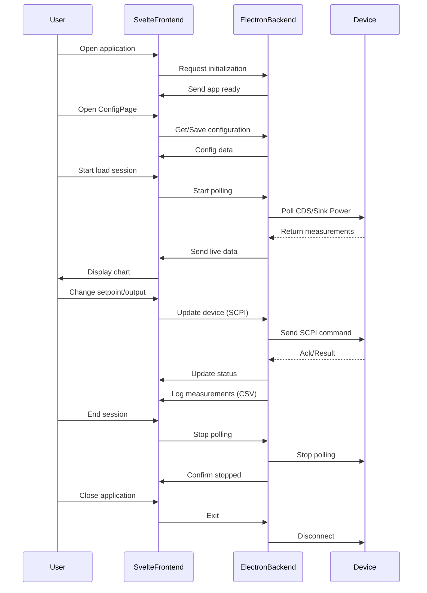

# Sequence Diagram: AC Dynamic Load Project

```mermaid
sequenceDiagram
    participant User
    participant SvelteFrontend
    participant ElectronBackend
    participant Device

    User->>SvelteFrontend: Open application
    SvelteFrontend->>ElectronBackend: Request initialization
    ElectronBackend->>SvelteFrontend: Send app ready

    User->>SvelteFrontend: Open ConfigPage
    SvelteFrontend->>ElectronBackend: Get/Save configuration
    ElectronBackend->>SvelteFrontend: Config data

    User->>SvelteFrontend: Start load session
    SvelteFrontend->>ElectronBackend: Start polling
    ElectronBackend->>Device: Poll CDS/Sink Power
    Device-->>ElectronBackend: Return measurements
    ElectronBackend->>SvelteFrontend: Send live data
    SvelteFrontend->>User: Display chart

    User->>SvelteFrontend: Change setpoint/output
    SvelteFrontend->>ElectronBackend: Update device (SCPI)
    ElectronBackend->>Device: Send SCPI command
    Device-->>ElectronBackend: Ack/Result
    ElectronBackend->>SvelteFrontend: Update status

    ElectronBackend->>SvelteFrontend: Log measurements (CSV)

    User->>SvelteFrontend: End session
    SvelteFrontend->>ElectronBackend: Stop polling
    ElectronBackend->>Device: Stop polling
    ElectronBackend->>SvelteFrontend: Confirm stopped

    User->>SvelteFrontend: Close application
    SvelteFrontend->>ElectronBackend: Exit
    ElectronBackend->>Device: Disconnect
```