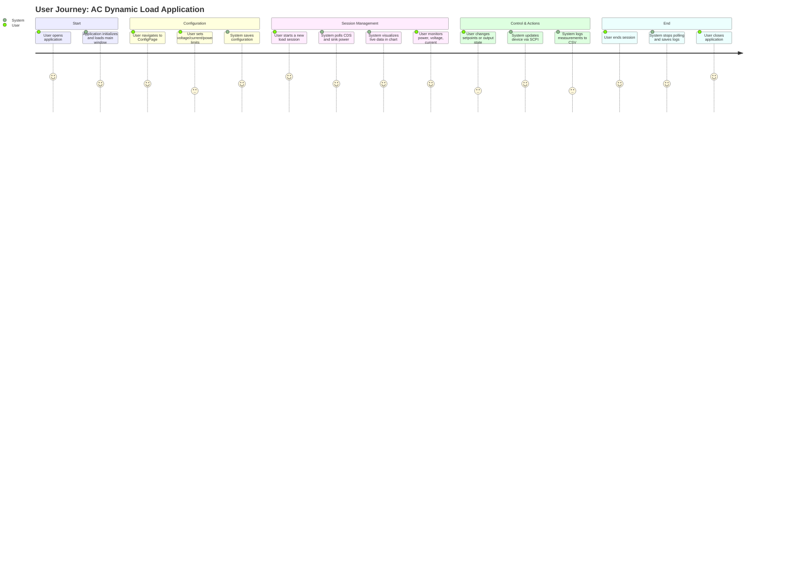

# User Journey Diagram for AC Dynamic Load Project

```mermaid
journey
    title User Journey: AC Dynamic Load Application
    section Start
      User opens application: 5: User
      Application initializes and loads main window: 4: System
    section Configuration
      User navigates to ConfigPage: 4: User
      User sets voltage/current/power limits: 3: User
      System saves configuration: 4: System
    section Session Management
      User starts a new load session: 5: User
      System polls CDS and sink power: 4: System
      System visualizes live data in chart: 4: System
      User monitors power, voltage, current: 4: User
    section Control & Actions
      User changes setpoints or output state: 3: User
      System updates device via SCPI: 4: System
      System logs measurements to CSV: 3: System
    section End
      User ends session: 4: User
      System stops polling and saves logs: 4: System
      User closes application: 5: User
```

